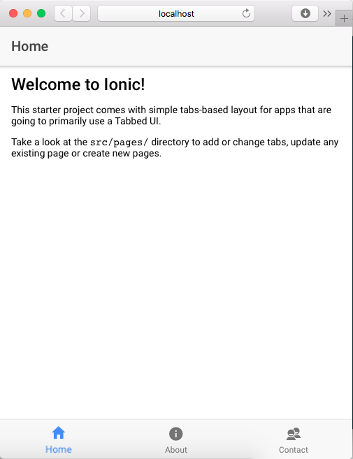
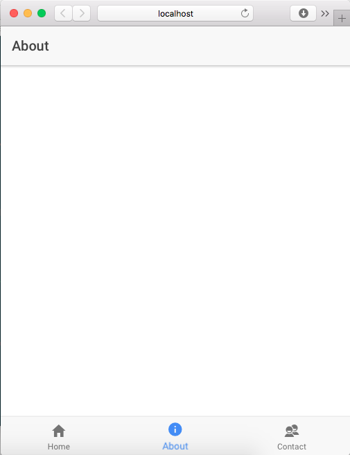
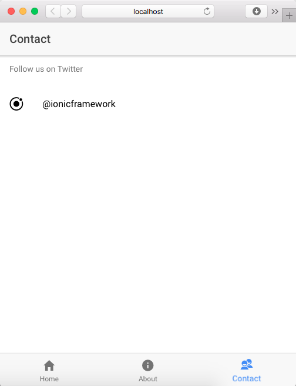

# MyLife - Meu projeto pessoal de gestão de atividades pessoais

Para utilizar este projeto, por favor, acesse: http://meunome.co.br/mylife

## O que é o projeto

Descrição do projeto.

## Principais funcionalidades

### Login

Esta tela é responsável por controlar o acesso do usuário ao sistema, é a primeira que é exibida.



### Cadastro de cliente

Esta ....



### Relatório dos principais clientes



## Como executa-lo

Se você for um programador, faça os seguintes passos:

```
....
```

## Diário de bordo

### Dia 1 - 08/02/2018

Neste dia eu fiz:

* X
* Y
* Z

A minha principal dificudade foi....

### Dia 2 - 09/02/2018

Hoje foi mais complicado porque...
